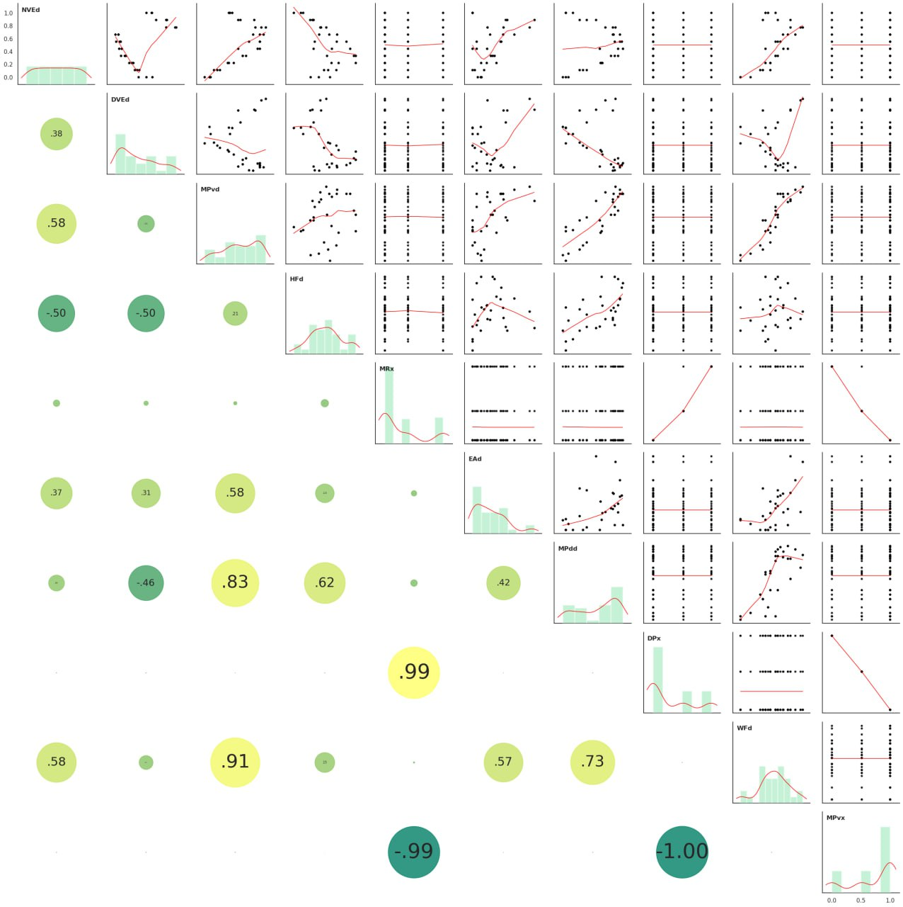
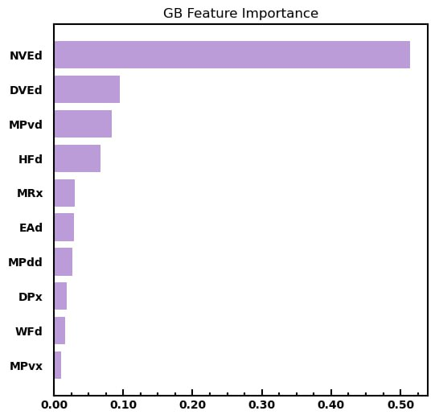

# BRL_project1

- 주관 : 과학기술정보통신부의 기초 연구실
- 주제 : "ML Application on Material Science"
- 일시 : 2021.06 ~ 2021.09
- 내용 : 수전해 촉매 소재의 대체재로 활용가치가 높아진 TMD 의 화학적 feature를 입력으로 받아, 촉매 소재 적합성을 예측하는 간단한 ML 프로젝트 

### Machine Learning for expedited screening of hydrogen evolution catalysts in doped transition metal dichalcogenides (TMDs)
- IJER (International Journal of Energy Research) [In-preparation]
- First author

    

    

- 데이터 시각화 및 실험 결과를 보여주는데 필수 및 기초적인 라이브러리인 `matplotlib`에 대한 이해
- Hyperparamter tuning
- 실제 수집된 TMD 데이터를 다루면서 촉매 소재로 적합한지 예측
